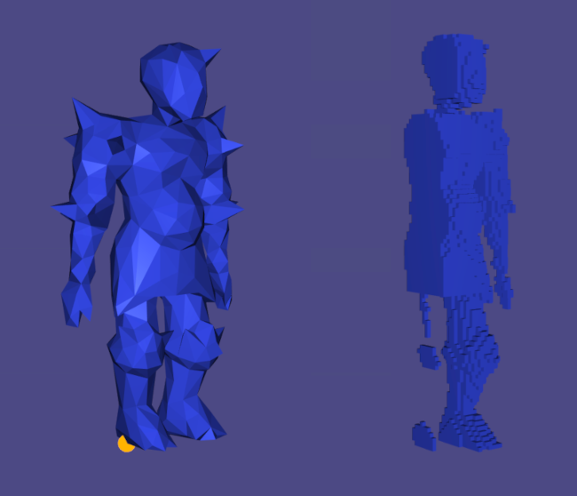

- [An Implementation of "Make It Stand" \[Prévost et al., 2013\]](#an-implementation-of-make-it-stand-prévost-et-al-2013)
  - [High-Level Idea of the Algorithm](#high-level-idea-of-the-algorithm)
  - [My Implementation](#my-implementation)
    - [Inner Carving](#inner-carving)
      - [Inputs](#inputs)
      - [Settings](#settings)
      - [Steps](#steps)
    - [Deformation](#deformation)
      - [Derivative of Mass w.r.t. Vertices](#derivative-of-mass-wrt-vertices)
      - [Derivative of Center of Mass w.r.t. Vertices](#derivative-of-center-of-mass-wrt-vertices)
      - [Linear Blend Skinning Matrix](#linear-blend-skinning-matrix)
      - [Laplacian](#laplacian)
      - [Gradient Descent](#gradient-descent)
    - [My Implementation v.s. The Authors' Impelementation](#my-implementation-vs-the-authors-impelementation)
    - [Known Limitations of My Implementation](#known-limitations-of-my-implementation)
    - [TODO](#todo)
# An Implementation of ["Make It Stand" [Prévost et al., 2013]](papers/make-it-stand-siggraph-2013-prevost-et-al.pdf)

The outer mesh (left) and the inner void (right) after running the inner carving algorithm. The contact point between the knight and the ground is selected so that it balances on its right foot.

## High-Level Idea of the Algorithm

The algorithm shifts the center of mass of an object a given triangle mesh represents, so that it balances without easily toppling after fabrication through 3D printing. It has two stages: 1) inner carving and 2) deformation. Inner carving shifts the center of mass by constructing an empty region inside the object. The second stage deforms the object into a more balanced pose.

## My Implementation

### Inner Carving
Creates an inner mesh to represent the boundary of the region to empty inside the object.

#### Inputs
1. The outer mesh.
2. Contact point between the outer mesh and the ground, on which the object should balances itself.

#### Settings
1. Direction of gravitational pull. In my case, it is the negative y-direction, as libigl's viewer uses the convention that the positive x- and y-direction are right and up, respectively.
2. Number of voxels along the longest side of the voxel grid used to compute the empty region. Increasing this number is equivalent to having smaller voxels. Smaller meshes require smaller voxels, and smaller voxels enable higher precision.
3. Minimum number of voxels to carve in each iteration of inner carving.
4. Minimum thickness of the object's physical shell, i.e. the minimum distance between the outer mesh and the inner mesh. This is currently calculated as the minimum distance between the outer mesh and the voxel **centers**.
5. Density of the 3D printing material.

#### Steps
1. Use igl::voxel_grid() to construct a voxel grid surrounding the outer mesh. Include a padding of at least one voxel, as it simplifies the later step of constructing the inner mesh. I used the overload of igl::voxel_grid() that takes the vertices of the outer mesh as an input. It fixes the padding count to 1, so setting the bounding box offset to 0 creates an adequate voxel grid.

2. Compute the center of mass and mass of the object using igl::centroid()'s outputs of centroid and volume, as the assumption that the object has uniform density ensures the equality of its centroid and center of mass, and its density is given.
 
3. Compute the initial value of the energy concerned with inner carving, which we shall call the carving energy $E_{carving} \in \mathbb{R}$. Let $c, k, \mathbf{g} \in \mathbb{R^3}$ be the center of mass, contact point, and gravitational pull, respectively. $E_{carving}$ is the squared norm of the projection of $d = c - k$ onto the gound, i.e. the subspace orthogonal to $\mathbf{g}$:

    $$E_{carving} = ||d - \frac{d \cdot \mathbf{g}}{||\mathbf{g}||^2} \mathbf{g}||^2$$

    This is equivalent to equation (7) in the [paper](papers/make-it-stand-siggraph-2013-prevost-et-al.pdf).
   
4. Iteratively identify (linear 1D) indicies of voxels in the voxel grid that are within the outer mesh by at least the minimum thickness. igl::signed_distance() can use fast winding number [Barill et al., 2018] to check if a point is inside a mesh, and calculate the distance between them. We only consider voxel centers that has a distance $s \in \mathbb{R}$ outputed by igl::signed_distance() s.t. $s \leq 0$ and $|s| \geq$ minimum thickness.

5. Imagine a plane that intersects $k$ and is perpendicular to $d$. It cuts the object into two regions. We now sort all voxel centers $r \in \mathbb{R^3}$ (survived from step 4) in decreasing order of their signed distance from the plane, which is computed as:
   
    $$s = (r - k)\left(d - \frac{d \cdot \mathbf{g}}{||\mathbf{g}||^2} \mathbf{g}\right)$$

    Those that are in the same region as the center of mass have positive signed distance. There is no need to ever compute the plane. 

    Concretely, use std::sort() and a custom comparator that is a lambda function that takes two voxel indices as inputs, and computes and compares their signed distance from the imaginary plane. 
   
6. Loop through the sorted voxels that have non-negative signed distance, and "carve" them one by one, i.e. update the center of mass and mass of the object at each iteration. Let $\rho, l \in \mathbb{R}$ be the density and side length of a voxel, respectively, and $c', m' \in \mathbb{R^3}$ be the center of mass and mass after "carving" the current voxel in consideration, respectively. Let $F = \{(v_i, v_j, v_k) \in \mathbb{R^3} \times \mathbb{R^3} \times \mathbb{R^3} : v_{i}, v_{j}, v_{k} \text{ form a face of the voxel}\}$. By convention, vertices of a voxel face are ordered such that they run counterclockwise on it. Let $\ast$ and $g$ be the element-wise multiplication, and the corresonding function on page 3 of the [paper](papers/make-it-stand-siggraph-2013-prevost-et-al.pdf), respectively.

    $$m' = m - \rho l^3$$

    $$c' = \frac{mc}{m'} - \frac{\rho}{24m'} \sum_{(v_{i}, v_{j}, v_{k}) \in F} ((v_j - v_i) \times (v_k - v_i)) * g(v_i, v_j, v_k)$$

    Record the index of the voxel which after being "carved" resulted in the minimum energy throughout this step. Also record the center of mass and mass after carving it. 

    Notice that we visit all sorted voxels with non-negative signed distance implies that we have not necessarily reached the minimum carving energy (for the current situation constructed based on the particular fixed imaginary plane) onced it stops decreasing. Why? Imagine filling a glass with water. Its center of mass is the same when it is empty and when it is full, but the center of mass changes during the processing of filling, it must be that it does not change in a monotonic manner.

7. Repeat step 5 with the recorded center of mass and mass from the previous step, and sort only the uncarved voxels, that is sort them with a new imaginary plane. Repeat step 6. Repeat this step (7) untill the carving energy (resulted from each of step 6) no longer decreases or the number of voxels "carved" is less than the minimun threshold specified in the settings above.

8. Construct the boundary of the voxels "carved", which is the inner mesh. First construct a mask that indicates which voxels are "carved", for example, at the $i$-th position, a value of $-1$ and $1$ indicates the $i$-th voxel is "carved" and not "carved", respectively. Loop through each dimension of the voxel grid, whenever there is a sign change from one voxel to the next, construct two triangle faces that form the square face between them. Order the vertices on a face such that they run clockwise on it.

### Deformation
Deforms the inner and outer mesh via linear blend skinning and bounded biharmonic weights [Jacobson et al., 2011].

Below defines the matrices needed for finding the optimal deformation via gradient descent. Please note that due to their shape and structure, the following matrices may not be applicable beyond this program.

Let $V \in \mathbb{R}^{|V| \times 3}$, $N \in \mathbb{R}^{|N| \times 3}$ be the vertices and handles, respective, where $|V|, |N| \in \mathbb{R}$ are the number of vertices and handles, respective. Let $v_{i} \in \mathbb{R}^3$ be the $i$-th vertex in $V$, and $v_{i}^{x} \in \mathbb{R}$ be the $x$-component of $v_{i}$, $v_{i}^{y}$ and $v_{i}^{z}$ are defined analogously. Let $F_{i}$ be the set of faces incident on $v_{i}$. Let $v_{i}'$ and $v_{i}''$ be the next and second next vertex on a face that incidents on $v_{i}$. The notion of "next" is defined relative to whether vertices run clockwise or counterclockwise on a face.

#### Derivative of Mass w.r.t. Vertices 
$\frac{\partial m}{\partial V} \in \mathbb{R}^{1 \times 3|V|}$:

$$
\frac{\partial m}{\partial V} = \begin{bmatrix}\dots & \frac{\partial m}{\partial v_{p}} & \dots
\end{bmatrix}
$$

$$
\frac{\partial m}{\partial v_{p}} = \begin{bmatrix} \frac{\partial m}{\partial v^{x}_{p}} & \frac{\partial m}{\partial v^{y}_{p}} & \frac{\partial m}{\partial v^{z}_{p}}
\end{bmatrix}
$$

$$
\begin{align}
\frac{\partial m}{\partial v^{x}_{p}} &= \frac{\rho}{6}\sum_{F_{p}}((v_{j} - v_{i}) \times (v_{k} - v_{i}))^{x}\\
&= \frac{\rho}{6}\sum_{F_{p}}v^{y}_{j}v^{z}_{k} - v^{y}_{j}v^{z}_{i} - v^{y}_{i}v^{z}_{k} - v^{z}_{j}v^{y}_{k} + v^{z}_{j}v^{y}_{i} + v^{z}_{i}v^{y}_{k}
\end{align}
$$

$$
\frac{\partial m}{\partial v^{y}_{p}} = \frac{\rho}{6}\sum_{F_{p}}(v^{z}_{p'} - v^{z}_{p''})(v^{x}_{i} + v^{x}_{j} + v^{x}_{k})
$$

$$
\frac{\partial m}{\partial v^{z}_{p}} = \frac{\rho}{6}\sum_{F_{p}}(v^{y}_{p''} - v^{y}_{p'})(v^{x}_{i} + v^{x}_{j} + v^{x}_{k})
$$

#### Derivative of Center of Mass w.r.t. Vertices
$\frac{\partial c}{\partial V} \in \mathbb{R}^{3 \times 3|V|}$:

$$
\frac{\partial c}{\partial V} = \frac{1}{m}\left(\frac{\partial (mc)}{\partial V} - c\frac{\partial m}{\partial V}\right)
$$

$$
\frac{\partial (mc)}{\partial V} = \begin{bmatrix}
\cdots & \frac{\partial (mc)}{\partial v_{p}} & \cdots
\end{bmatrix}
$$

$$
\frac{\partial (mc)}{\partial v_{p}} = \frac{\rho}{24}\sum_{F_{p}}\begin{bmatrix}
((v_{j} - v_{i}) \times (v_{k} - v_{i}))^{x}(2v^{x}_{i} + v^{x}_{j} + v^{x}_{k}) & g(v_i, v_j, v_k)^{x}(v^z_{i} - v^z_{k}) & g(v_i, v_j, v_k)^{x}(v^{y}_{k} - v^{y}_{j})\\
g(v_i, v_j, v_k)^{y}(v^{z}_{j} - v^{z}_{k})& ((v_{j} - v_{i}) \times (v_{k} - v_{i}))^{y}(2v^{y}_{i} + v^{y}_{j} + v^{y}_{k}) & g(v_i, v_j, v_k)^{y}(v^{x}_{k} - v^{x}_{j})\\
g(v_i, v_j, v_k)^{z}(v^{y}_{j} - v^{y}_{k}) & g(v_i, v_j, v_k)^{z}(v^{x}_{k} - v^{x}_{j}) & ((v_{j} - v_{i}) \times (v_{k} - v_{i}))^{z}(2v^{z}_{i} + v^{z}_{j} + v^{z}_{k})
\end{bmatrix}
$$

#### Linear Blend Skinning Matrix
$M \in \mathbb{R}^{3|V| \times 4|N|}$. Slice $M$ evenly into $|V|$ rows and $|N|$ columns of sub-matrices of size $3 \times 4$, and let $M_{ij}$ be the sub-matrix on the $i$-th row and $j$-th column. Let $w_{ij}$ be the bounded biharmonic weight of the $j$-th handle on the $i$-th vertex, then:

$$
M_{ij} = w_{ij}\begin{bmatrix}
1 & 0 & 0 & v_{i}^{x}\\
0 & 1 & 0 & v_{i}^{x}\\
0 & 0 & 1 & v_{i}^{x}
\end{bmatrix}
$$

#### Laplacian
$M_{Lap} \in \mathbf{R}^{3 |V| \times 3 |V|}$. Slice $M_{Lap}$ evenly into $|V|$ rows and $|V|$ columns of sub-matrices of size $3 \times 3$, and let $L_{ij}$ be the sub-matrix on the $i$-th row and $j$-th column. Assume that an (undirected) edge $\{v_{i}, v_{j}\}$ exists if and only if the two directed edges $(v_{i}, v_{j})$ and $(v_{i}, v_{j})$ exist. If $(v_{i}, v_{j})$ exists and $i \neq j$, let $\alpha_{ij}$ and $\beta_{ij}$ be the two angles opposite to this edge, for more details, please refer to [Finite Element Derivation of the Discrete Laplacian](https://github.com/alecjacobson/geometry-processing-smoothing#finite-element-derivation-of-the-discrete-laplacian), then:

$$
L_{ij} = \begin{bmatrix}
c_{ij} & 0 & 0\\
0 & c_{ij} & 0\\
0 & 0 & c_{ij}
\end{bmatrix}
$$

$$
c_{ij} = \begin{cases}
         \frac{1}{2}  \cot{{\alpha}_{ij}} + \frac{1}{2}  \cot{{\beta}_{ij}}  & \text{if $(v_{i}, v_{j})$ exists} \\
         - {\sum}_{j\ne i} L_{ij}                   & \text{if $i = j$} \\
         0                                & \text{otherwise}
         \end{cases}
$$

#### Gradient Descent
**In Progress**

### My Implementation v.s. The Authors' Impelementation
1. The authors' implementation has two balancing mode: 1) the standing mode and 2) the suspension mode, while mine only implemented the standing mode.
2. The authors' implementation does not sort voxels that have negative signed distance.
3. In my implementation, normals of the inner mesh point inward, as the authors recommend, but in my particular implementation, I do not think it matters. This suggests that the authors' implementation may be more efficient in constructing the inner mesh.

### Known Limitations of My Implementation
1. The ideal way of measuring the minimum distance between the outer mesh and the inner mesh would be to measure from the outer mesh to the corners of the voxels.
2. Density seems to be unnecessary.
3. Storing the voxel grid as a matrix of voxel centers may not be the best way to do so.
4. Deformation has yet to be completed, as calculating bounded biharmonic weights for the voxel grid has yet to be compeleted.
5. The authors suggest that there should be no floating components, but my implementation results in them.
6. update_center_of_mass() has a precision issue when compared against igl::centroid.

### TODO
- [ ] Check whether the positive or negative semi-definite version of the Laplacian is used.