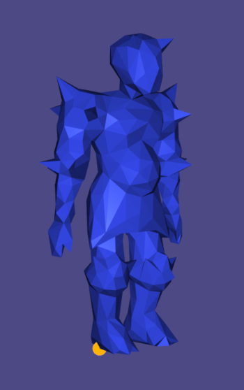

# An Implementation of Make It Stand (add reference to the paper here)

## General Idea of the Algorithm

The algorithm shifts the center of mass of the object a given triangle mesh represents, so that it balances without easily toppling after fabrication through 3D printing. It uses two methods: 1) inner carving and 2) deformation. Inner carving creates a mesh to represent an empty region to be constructed inside the input mesh. From now on, we shall call them the inner and outer mesh, respectively. Essentailly, inner carving shift the center of mass by redistributing mass. Deformation shifts it by deforming the inner and outer mesh via linear blend skinning (LBS) using bounded biharmonic weights.

## My Implementation

### Inner Carving

#### Inputs
1. The outer mesh.
2. Contact point between the outer mesh and the ground, on which the object should balances itself.

#### Settings
1. Direction of gravitational pull. In my case, it is the negative y-direction, as libigl's viewer uses the convention that the positive x- and y-direction are right and up, respectively.
2. Size of a voxel. Smaller meshes require smaller voxels, and smaller voxels enable higher precision.
3. Minimum number of voxels to carve in each iteration of inner carving
4. Minimum thickness of the object's physical shell, i.e. the minimum distance between the outer mesh and the inner mesh. This is currently calculated as the minimum distance between the outer mesh and the voxel **CENTERS**.
5. Density of the 3D printing material.

#### Steps
1. Use igl::voxel_grid() to construct a voxel grid surrounding the outer mesh. Include a padding of at least one voxel, as it simplifies the later step of constructing the inner mesh. I used the overload of igl::voxel_grid() that takes the vertices of the outer mesh as an input. It fixes the padding count to be 1, so setting the bounding box offset to be 0 creates an adequate voxel grid.

2. Compute the center of mass and mass of the object using igl::centroid()'s outputs of centroid and volume, as the assumption that input objects have uniform density ensures the equality of centroid and center of mass, and the density is available.
 
3. Compute the initial value of the energy concerned with inner carving, which we shall call the carving energy $C$, and it is the squared norm of the projection of the vector $d = \text{center of mass} - \text{contact}$ onto the subspace perpendicular to the direction of gravitational pull $g$:

$$C = ||d - \frac{d \cdot g}{||g||^2}g||^2$$

4. Iteratively identify indicies of voxels in the voxel grid that are within the outer mesh by at least the minimum thickness. igl::signed_distance() can use fast winding number to check if a point is inside a mesh and calculate its distance from it. We only consider voxel centers that has a distance $s$ outputed by igl::signed_distance() s.t. $s \leq 0$ and $|s| \geq \text{minimum thickness}$.

5. Imagine a plane that intersects the contact point $c$ and is perpendicular to $d$. It cuts the object into two regions. We now sort all voxel centers $r$ (survived from step 4) in decreasing order of their signed distance $s$ from the plane, which is computed as:

$$s = (r - c) \cdot (d - \frac{d \cdot g}{||g||^2}g)$$

Those that are in the same region as the center of mass have positive signed distance. There is no need to ever compute the plane. 

Concretely, use std::sort() and a custom comparator that is a lambda function that takes two voxel indices as inputs, and compute and compare their signed distance from the imaginary plane. 

6. Loop through the sorted voxels that have non-negative signed distance, and "carve" them one by one, i.e. update the center of mass and mass of the object at each iteration. Let $\rho$ be the density, and $CoM_{old}$ and $m_{old}$ be the center of mass and mass before "carving" the current voxel in consideration, respectively, their counterparts after "carving", $CoM_{new}$ and $m_{new}$ are:

$$m_{new} = m_{old} - \rho \cdot l^3$$

$$CoM_{new} = \frac{CoM_{old} \cdot m_{old}}{m_{new}} - \frac{\rho}{24m_{new}}\sum_{f \in F} ((v_j - v_i) \times (v_k - v_i)) * g(v_i, v_j, v_k)$$

$F$ is the set of triangle faces of the voxel, and $f = (v_i, v_j, v_k) \in F$. $\*$ is element-wise multiplication, and please refer to page 3 of the paper for defintion of the function $g()$.

Calculate the new energy using $CoM_{new}$ at the end of each iteration. Record the index of the voxel which after being "carved" resulted in the minimum energy throughout this step. Also record the center of mass and mass after carving it. 

Notice that we visit all sorted voxels with non-negative signed distance implies that we have not necessarily reached the minimum carving energy (for the current situation constructed based on the particular fixed imaginary plane) onced it stops decreasing. For why, imagine filling a glass with water. Its center of mass is the same when it is empty and when it is full, but it changes during the processing of filling, it must be that it does not change in a monotonic manner.

7. Repeat step 5 with the recorded center of mass and mass from the previous step, and sort only the uncarved voxels, that is sort them with a new imaginary plane. Repeat step 6. Repeat this step (7) untill the carving energy (resulted from each of step 6) no longer decreases or the number of voxels "carved" is less than the minimun threshold specified in the settings above.

8. Construct the boundary of the voxels "carved", which is the inner mesh. First construct a mask that indicates which voxels are "carved", for example, at the $i$-th position, a value of $-1$ and $1$ indicates the $i$-th voxel is "carved" and not "carved", respectively. Loop through each dimension of the voxel grid, whenever there is a sign change from one voxel to the next, construct two triangle faces that form the square face between them.

#### A Small Showcase
The followings are the outer mesh (left) and the inner void (right) after running the inner carving algorithm. The contact point between the figure and the ground is selected so that it can balance on its right foot.

### Deformation

Please note that due to their shape and structure, the following matrices may not be applicable beyond this program.

#### Derivative of Mass w.r.t. Vertices $\frac{\partial m}{\partial V}$
$\frac{\partial m}{\partial V}$ is a $1 \times 3|V|$ matrix:

$$
\frac{\partial m}{\partial V} = \begin{bmatrix}\dots & \frac{\partial m}{\partial v_{p}} & \dots
\end{bmatrix}
$$

$$
\frac{\partial m}{\partial v_{p}} = \begin{bmatrix} \frac{\partial m}{\partial v^{x}_{p}} & \frac{\partial m}{\partial v^{y}_{p}} & \frac{\partial m}{\partial v^{z}_{p}}
\end{bmatrix}
$$

$$
\begin{align}
\frac{\partial m}{\partial v^{x}_{p}} &= \frac{\rho}{6}\sum_{N_{p}}((v_{j} - v_{i}) \times (v_{k} - v_{i}))^{x}\\
&= \frac{\rho}{6}\sum_{N_{p}}v^{y}_{j}v^{z}_{k} - v^{y}_{j}v^{z}_{i} - v^{y}_{i}v^{z}_{k} - v^{z}_{j}v^{y}_{k} + v^{z}_{j}v^{y}_{i} + v^{z}_{i}v^{y}_{k}
\end{align}
$$

$$
\frac{\partial m}{\partial v^{y}_{p}} = \frac{\rho}{6}\sum_{N_{p}}(v^{z}_{p + 1} - v^{z}_{p + 2})(v^{x}_{i} + v^{x}_{j} + v^{x}_{k})
$$

$$
\frac{\partial m}{\partial v^{z}_{p}} = \frac{\rho}{6}\sum_{N_{p}}(v^{y}_{p + 2} - v^{y}_{p + 1})(v^{x}_{i} + v^{x}_{j} + v^{x}_{k})
$$

#### Derivative of Center of Mass w.r.t. Vertices $\frac{\partial CoM}{\partial V}$
$\frac{\partial CoM}{\partial V}$ is a $3 \times 3|V|$ matrix:

$$
\frac{\partial CoM}{\partial V} = \frac{1}{m}\left(\frac{\partial (m \cdot CoM)}{\partial V} - CoM\frac{\partial m}{\partial V}\right)
$$

$$
\frac{\partial (m \cdot CoM)}{\partial V} = \begin{bmatrix}
\cdots & \frac{\partial (m \cdot CoM)}{\partial v_{p}} & \cdots
\end{bmatrix}
$$

$$
\frac{\partial (m \cdot CoM)}{\partial v_{p}} = \frac{\rho}{24}\sum_{N_{p}}\begin{bmatrix}
((v_{j} - v_{i}) \times (v_{k} - v_{i}))^{x}(2v^{x}_{i} + v^{x}_{j} + v^{x}_{k}) & (v^z_{i} - v^z_{k})g(v_i, v_j, v_k)^{x} & (v^{y}_{k} - v^{y}_{j})g(v_i, v_j, v_k)^{x}\\
(v^{z}_{j} - v^{z}_{k})g(v_i, v_j, v_k)^{y}& ((v_{j} - v_{i}) \times (v_{k} - v_{i}))^{y}(2v^{y}_{i} + v^{y}_{j} + v^{y}_{k}) & (v^{x}_{k} - v^{x}_{j}g(v_i, v_j, v_k)^{y}\\
(v^{y}_{j} - v^{y}_{k})g(v_i, v_j, v_k)^{z} & (v^{x}_{k} - v^{x}_{j})g(v_i, v_j, v_k)^{z} & ((v_{j} - v_{i}) \times (v_{k} - v_{i}))^{z}(2v^{z}_{i} + v^{z}_{j} + v^{z}_{k})
\end{bmatrix}
$$

#### Linear Blend Skinning Matrices $M$
$M$ is $3|V| \times 4|N|$. Slice $M$ evenly into $|V| \cdot |N|$ sub-matrices of size $3 \times 4$, and let $M_{ij}$ be the sub-matrix on the $i$-th row and $j$-th column, then:

$$
M = \begin{bmatrix}
 & \vdots & \\
\dots & M_{ij} & \dots\\
 & \vdots & 
\end{bmatrix}
$$

$$
M_{ij} = \begin{bmatrix}
\end{bmatrix}
$$

#### Laplacian

#### Gradient Descent
In Progress...

### My Implementation v.s. The Authors' Impelementation
1. The authors' implementation has two balancing mode: 1) the standing mode and 2) the suspension mode, while mine only implemented the standing mode.
2. The authors' implementation does not sort voxels that have negative signed distance.
3. In my implementation, normals of the inner mesh point inward, as the authors recommend, but in my particular implementation, I do not think it matters. This suggests that the authors' implementation may be more efficient in constructing the inner mesh.

### Known Limitations of My Implementation
1. The ideal way of measuring the minimum distance between the outer mesh and the inner mesh would be to measure from the outer mesh to the corners of the voxels.
2. Density seems to be unnecessary.
3. Storing the voxel grid as a matrix of voxel centers may not be the best way to do so.
4. Deformation has yet to be completed, as calculating bounded biharmonic weights for the voxel grid has yet to be compeleted.
5. The authors suggest that there should be no floating components, but my implementation results in them.
6. update_center_of_mass() has a precision issue when compared against igl::centroid.
