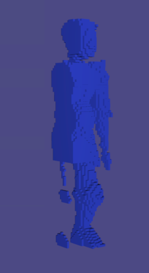

# An Implementation of Make It Stand

I plan to complete this project by January 9th 2023.

## A small showcase of progress

## What is done

1. Inner carving: The iterative processing of finding the optimal inner void to empty, and the construction of its mesh have been implemented.
  
2. Matrices for deformation: The optimal deformation is obtained via gradient descent. Functions that build the matrices required for the computation have been implemented.

3. Added GoogleTest Framework.

## What is in progress
  
1. ~~Add GoogleTest framework: To conduce an easier and more complete debugging process.~~

2. Bounded biharmonic weights(BBW) for voxel grid: BBW need to be computed for each voxel of a grid, from which meshes obtain their weights via interpolation for deformation.

3. Add test suites.

Thanks.
